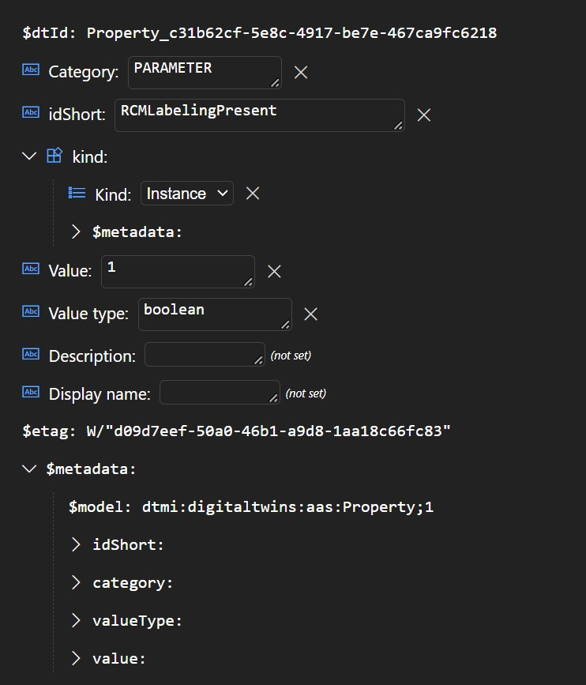

# Querying the Azure Digital Twins graph

Using the Asset Administration shell Metamodel ontology to model assets in Azure Digital Twins can lead to quite complex graphs. E.g. the standard sample '01_Festo' looks like the following:


To find an AAS Referable in the graph, a list of keys (one global followed by local ones) is used. E.g. for finding the boolean Property 'RCMLabelingPresent' in the 01_Festo sample the keylist looks like:

```xml
<aas:keys>
	<aas:key type="AssetAdministrationShell" idType="IRI">smart.festo.com/demo/aas/1/1/454576463545648365874</aas:key>
	<aas:key type="Submodel" idType="IdShort">Nameplate</aas:key>
	<aas:key type="SubmodelElementCollection" idType="IdShort">Marking_RCM</aas:key>
	<aas:key type="Property" idType="IdShort">RCMLabelingPresent</aas:key>
</aas:keys>
```

Using the [ADT Query language](https://docs.microsoft.com/en-us/azure/digital-twins/concepts-query-language) the following two queries have to be used to find the according twin in the graph:

1. Find Identifiable twin

```sql
SELECT * FROM digitaltwins WHERE IS_OF_MODEL('dtmi:digitaltwins:aas:Identifiable;1') 
AND identification.idType = 'IRI' 
AND identification.id = 'smart.festo.com/demo/aas/1/1/454576463545648365874'
```

2. Find referable twin with the Identifiable twin Id (from first query)

```sql
SELECT referable3 FROM DIGITALTWINS MATCH(identifiable)-[]->(referable1)-[]->(referable2)-[]->(referable3) 
WHERE identifiable.$dtId = 'Shell_5a0f3d6d-c21e-4704-b09e-eae6fa7dc45b' 
AND referable1.idShort = 'Nameplate' AND IS_OF_MODEL(referable1, 'dtmi:digitaltwins:aas:Submodel;1') 
AND referable2.idShort = 'Marking_RCM' AND IS_OF_MODEL(referable2, 'dtmi:digitaltwins:aas:SubmodelElementCollection;1') 
AND referable3.idShort = 'RCMLabelingPresent' AND IS_OF_MODEL(referable3, 'dtmi:digitaltwins:aas:Property;1')
```

The second query will return Property twin:


